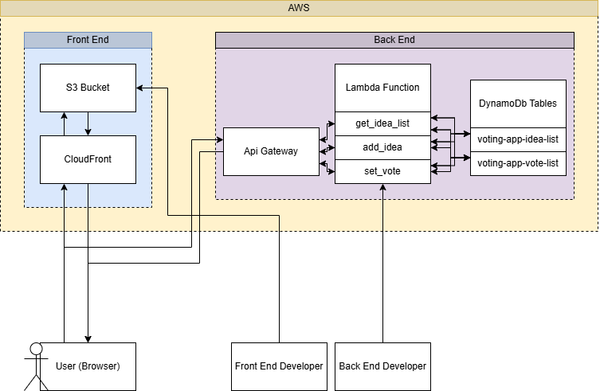

# Aplikacja do Głosowania (Voting App)

To kompletna aplikacja do głosowania, składająca się z **frontendu napisanego w React.js** i **backendu zbudowanego na AWS Lambda (Python)**. Cała infrastruktura jest zarządzana za pomocą **Terraforma**, co umożliwia zarządzanie infrastrukturą jako kodem **(IaC)**.

**Użytkownicy mogą dodawać własne pomysły, które będą rozważane do realizacji w przyszłych sesjach kodowania, oraz głosować na już zgłoszone propozycje.** To interaktywne narzędzie pozwala społeczności aktywnie wpływać na kierunek rozwoju projektu!

---

## Architektura

Aplikacja jest podzielona na dwie główne części: Frontend i Backend, wdrożone na platformie AWS.

### Frontend

Frontend aplikacji to statyczna strona internetowa napisana w React, hostowana na AWS S3 i serwowana globalnie przez AWS CloudFront.

- **AWS S3 Bucket:** Przechowuje wszystkie statyczne pliki (HTML, CSS, JavaScript, obrazy) aplikacji React. Skonfigurowany z kontrolą wersji, blokadą publicznego dostępu oraz kontrolą własności, aby zapewnić bezpieczeństwo.
- **AWS CloudFront Distribution:** Globalna sieć dostarczania treści (CDN), która przyspiesza dostęp do aplikacji dla użytkowników na całym świecie poprzez buforowanie zawartości w lokalizacjach brzegowych. Zapewnia bezpieczny dostęp do S3 bucketu za pomocą Origin Access Control (OAC).

### Backend

Backend aplikacji to bezserwerowe API zbudowane na AWS Lambda i API Gateway, korzystające z DynamoDB do przechowywania danych.

- **AWS DynamoDB:** Dwie tabele NoSQL przechowujące dane aplikacji:
  - `voting-app-idea-list`: Lista pomysłów, na które można głosować.
  - `voting-app-vote-list`: Przechowuje oddane głosy.
- **AWS Lambda Functions (Python):** Trzy bezserwerowe funkcje obsługujące logikę biznesową:
  - `get_idea_list`: Pobiera listę dostępnych pomysłów.
  - `add_idea`: Dodaje nowy pomysł do listy.
  - `set_vote`: Rejestruje głos oddany na pomysł.
- **AWS IAM Role:** Specjalna rola zarządzająca uprawnieniami, która pozwala funkcjom Lambda bezpiecznie komunikować się z tabelami DynamoDB.
- **AWS API Gateway:** Służy jako punkt wejścia HTTP dla frontendu, kierując żądania do odpowiednich funkcji Lambda.



---

## Wdrożenie Aplikacji

Infrastruktura aplikacji jest w pełni zarządzana za pomocą Terraform.

### Wdrożenia Infrastruktury

Proces wdrożenia infrastruktury jest następujący:

1.  **Klonowanie Repozytorium:**
    Rozpocznij od sklonowania repozytorium projektu na lokalny komputer:

    ```bash
    git clone https://github.com/piotex/Voting-App.git
    cd Voting-App
    ```

2.  **Inicjalizacja Terraform:**
    Przejdź do katalogu głównego projektu (zawierającego `main.tf`) i zainicjuj Terraform. Proces ten pobierze niezbędnych dostawców (providers) oraz moduły.

    ```bash
    terraform init
    ```

3.  **Weryfikacja Planu Wdrożenia:**
    Wygeneruj plan wykonania Terraform, aby szczegółowo przeanalizować listę zasobów, które zostaną utworzone lub zmodyfikowane.

    ```bash
    terraform plan -out="deployment_plan.tfplan"
    ```

    - **Uwaga dotycząca usuwania S3:** Przed usunięciem S3 Bucketa należy usunąć całą jego zawartość.

4.  **Aplikacja Wdrożenia:**
    Po pozytywnej weryfikacji planu, zastosuj zmiany w celu wdrożenia infrastruktury AWS.

    ```bash
    terraform apply "deployment_plan.tfplan"
    ```

    System może poprosić o potwierdzenie operacji poprzez wpisanie `yes`.

5.  **Dostęp do Aplikacji:**
    Po pomyślnym zakończeniu wdrożenia, Terraform wyświetli wartości wyjściowe (outputs). Wartość `cloudfront_domain_name` będzie adresem URL, pod którym aplikacja frontendowa będzie dostępna.

    ```bash
    Outputs:

    api_gateway_endpoint = "https://xxx.execute-api.eu-central-1.amazonaws.com"
    cloudfront_domain_name = "xxx.cloudfront.net"

    ```

    Prosimy o skopiowanie wartości `cloudfront_domain_name` i wklejenie jej do przeglądarki w celu uzyskania dostępu do aplikacji.

---

## Deployment Aplikacji Frontend

Po pomyślnym wdrożeniu infrastruktury za pomocą Terraform, możesz zbudować i wdrożyć aplikację React na skonfigurowany bucket S3.

0. **Dodanie endpointa do api**
   Wartość api_gateway_endpoint należy przekazać do stałej API w

   ```bash
   front-end/src/constants/api.ts
   ```

   aby umożliwić komunikację front endu z back endem.

1. **Przygotowanie Aplikacji React:**
   Przejdź do katalogu `front-end`, zainstaluj zależności i zbuduj projekt.

   ```bash
   cd ./front-end
   yarn install
   yarn build
   ```

2. **Wdrożenie na AWS S3:**
   Skompilowane pliki aplikacji zostaną wgrane do bucketu S3, który jest skonfigurowany jako origin dla CloudFront.

   Pamiętaj, aby podać **prawidłową nazwę swojego bucketu S3**. Jeśli bucket został utworzony przez Terraform w głównym pliku `main.tf` jako `voting-app-kubon-tech-frontend-prod` (lub `voting-app-kubon-tech-frontend-test`), użyj tej nazwy.

   ```bash
   # Upewnij się, że ta zmienna zawiera DOKŁADNĄ nazwę twojego S3 bucketu
   S3_BUCKET_NAME="voting-app-kubon-tech-frontend-prod" # Zastąp prawidłową nazwą bucketa

   # Opcjonalnie: Usuń poprzednią zawartość bucketa (użyj ostrożnie!)
   # To jest przydatne, aby zapewnić, że stare pliki są usunięte i nie kolidują z nowymi.
   aws s3 rm "s3://${S3_BUCKET_NAME}" --recursive

   # Skopiuj zbudowane pliki aplikacji do bucketu S3
   aws s3 cp build/ "s3://${S3_BUCKET_NAME}" --recursive
   ```

**Uwagi dotyczące wdrożenia:**

- **Unieważnienie pamięci podręcznej (Cache Invalidation):** Po wdrożeniu nowych plików na S3, może być konieczne unieważnienie pamięci podręcznej CloudFront, aby użytkownicy od razu widzieli najnowszą wersję aplikacji. Możesz to zrobić ręcznie w konsoli CloudFront lub za pomocą AWS CLI:

  ```bash
  # Uzyskaj ID swojej dystrybucji CloudFront z wyjść Terraform
  CLOUDFRONT_DISTRIBUTION_ID="E123456ABCDEF" # Zastąp prawidłowym ID

  aws cloudfront create-invalidation --distribution-id "${CLOUDFRONT_DISTRIBUTION_ID}" --paths "/*"
  ```

---

### Proces Dekomisji Infrastruktury (Destroy)

W celu usunięcia wszystkich zasobów utworzonych przez Terraform, wykonaj komendę:

```bash
terraform destroy
```

Pamiętaj o wcześniejszym opróżnieniu S3 Bucketa.
